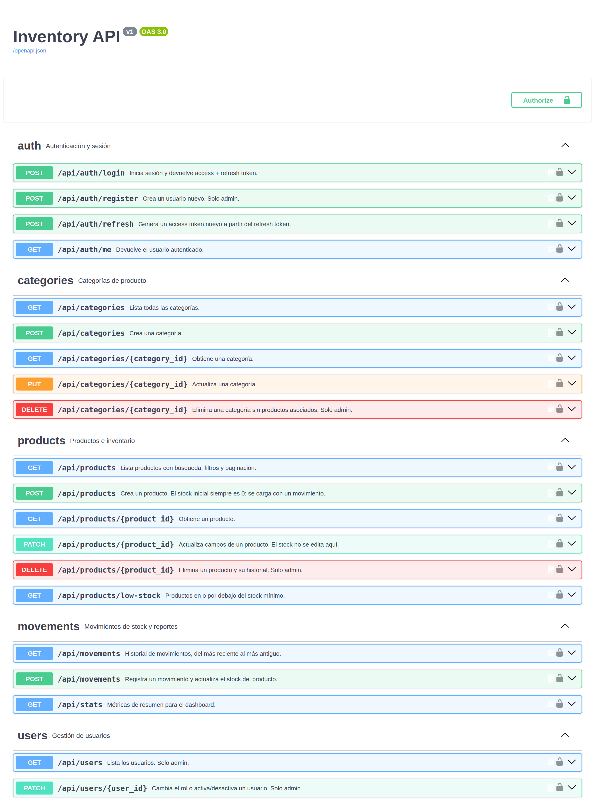

# Inventory API

API REST para control de inventario con autenticación JWT, permisos por rol y documentación OpenAPI generada automáticamente. Cada cambio de stock queda registrado como un movimiento con usuario, cantidad y stock resultante.

Construida sobre un caso real: control de existencias de repuestos y consumibles en planta.

## Demo en vivo

| | |
|---|---|
| **Documentación interactiva (Swagger)** | https://inventory-api-xdk7.onrender.com/docs |
| **Dashboard que consume este API** | https://inventory-dashboard-mfxf.onrender.com |
| **Credenciales** | `admin` / `admin1234` · `bodega` / `bodega1234` · `consulta` / `consulta1234` |

> Corre en el plan gratuito de Render: si estuvo sin tráfico, la primera petición puede tardar cerca de un minuto en despertar el servicio.



## Stack

| Componente | Tecnología |
|---|---|
| Framework | Flask 3 + flask-smorest |
| Base de datos | PostgreSQL + SQLAlchemy 2 |
| Migraciones | Alembic (Flask-Migrate) |
| Autenticación | JWT (access + refresh) |
| Validación / serialización | Marshmallow |
| Documentación | OpenAPI 3.0 + Swagger UI |
| Pruebas | pytest (18 casos) |
| Despliegue | Docker + docker compose + Gunicorn |

## Qué resuelve

- **Stock no editable a mano.** El campo `stock` solo cambia registrando un movimiento (`in`, `out`, `adjust`). Eso deja historial completo y evita ajustes silenciosos.
- **Salidas validadas.** Una salida mayor al stock disponible devuelve `409` en vez de dejar existencias negativas.
- **Alerta de mínimos.** Cada producto define su `min_stock`; `/api/products/low-stock` y `/api/stats` exponen los que están en o bajo ese umbral.
- **Permisos reales en el servidor.** El rol viaja como claim del JWT y se valida en cada endpoint con un decorador, no en el frontend.

## Roles

| Acción | admin | manager | viewer |
|---|:---:|:---:|:---:|
| Consultar productos, movimientos y reportes | ✅ | ✅ | ✅ |
| Crear y editar productos y categorías | ✅ | ✅ | — |
| Registrar movimientos de stock | ✅ | ✅ | — |
| Eliminar productos o categorías | ✅ | — | — |
| Crear usuarios y cambiar roles | ✅ | — | — |

## Endpoints

| Método | Ruta | Rol mínimo |
|---|---|---|
| POST | `/api/auth/login` | público |
| POST | `/api/auth/refresh` | refresh token |
| GET | `/api/auth/me` | autenticado |
| POST | `/api/auth/register` | admin |
| GET / POST | `/api/categories` | viewer / manager |
| GET / PUT / DELETE | `/api/categories/{id}` | viewer / manager / admin |
| GET / POST | `/api/products` | viewer / manager |
| GET / PATCH / DELETE | `/api/products/{id}` | viewer / manager / admin |
| GET | `/api/products/low-stock` | viewer |
| GET / POST | `/api/movements` | viewer / manager |
| GET | `/api/stats` | viewer |
| GET | `/api/users` | admin |
| PATCH | `/api/users/{id}` | admin |

`GET /api/products` acepta `q`, `category_id`, `low_stock`, `page` y `per_page`.

## Cómo correrlo

### Con Docker (recomendado)

```bash
git clone https://github.com/Aaronloji/inventory-api.git
cd inventory-api
docker compose up --build -d
docker compose exec api python seed.py   # datos de ejemplo
```

API en `http://localhost:5000` · documentación en `http://localhost:5000/docs`

### Local

```bash
python -m venv .venv && source .venv/bin/activate   # Windows: .venv\Scripts\activate
pip install -r requirements.txt
cp .env.example .env            # ajustar DATABASE_URL y JWT_SECRET_KEY
python seed.py                  # crea el esquema y carga datos de ejemplo
flask --app wsgi run
```

Funciona también sobre SQLite para probar rápido:

```bash
DATABASE_URL="sqlite:///demo.db" python seed.py
```

### Usuarios de ejemplo

| Usuario | Contraseña | Rol |
|---|---|---|
| admin | admin1234 | admin |
| bodega | bodega1234 | manager |
| consulta | consulta1234 | viewer |

## Ejemplo de uso

```bash
# 1. Autenticarse
TOKEN=$(curl -s -X POST http://localhost:5000/api/auth/login \
  -H 'Content-Type: application/json' \
  -d '{"username":"admin","password":"admin1234"}' | jq -r .access_token)

# 2. Crear un producto (stock inicia en 0)
curl -X POST http://localhost:5000/api/products \
  -H "Authorization: Bearer $TOKEN" -H 'Content-Type: application/json' \
  -d '{"sku":"HER-003","name":"Esmeriladora 4.5","unit_price":"65000.00","min_stock":2,"category_id":1}'

# 3. Cargar existencias
curl -X POST http://localhost:5000/api/movements \
  -H "Authorization: Bearer $TOKEN" -H 'Content-Type: application/json' \
  -d '{"product_id":7,"type":"in","quantity":10,"note":"Factura 1042"}'

# 4. Ver métricas
curl http://localhost:5000/api/stats -H "Authorization: Bearer $TOKEN"
```

## Pruebas

```bash
pytest -q
```

18 pruebas sobre SQLite en memoria: login y expiración de token, control de acceso por rol en cada verbo, SKU duplicado, búsqueda, entradas y salidas de stock, salida mayor al disponible y detección de mínimos. Corren en cada push con GitHub Actions.

## Estructura

```
app/
├── api/           # Endpoints (MethodView por recurso)
├── models/        # SQLAlchemy: User, Category, Product, StockMovement
├── utils/         # Decorador de control de acceso por rol
├── config.py      # Configuración por entorno
├── extensions.py  # Instancias de extensiones
└── schemas.py     # Marshmallow: validación de entrada y salida
tests/             # pytest
seed.py            # Datos de ejemplo
```

## Decisiones de diseño

- **flask-smorest** en lugar de Flask puro: la documentación OpenAPI sale de los mismos schemas que validan la entrada, así que no se desactualiza.
- **Movimientos inmutables**: el historial no se edita ni se borra; un error se corrige con un ajuste, que también queda registrado.
- **`stock` denormalizado en `products`**: evita recalcular la suma de movimientos en cada consulta. La coherencia se mantiene escribiendo ambos en la misma transacción.
- **Autorización en el backend**: el frontend oculta botones por comodidad, pero el permiso se decide en el servidor.

## Licencia

MIT
